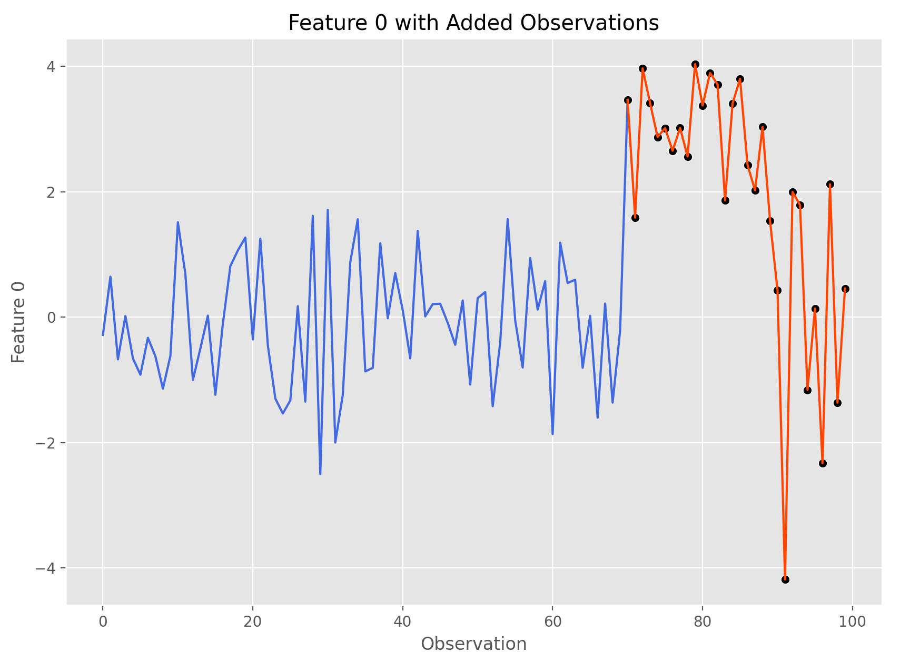

Simulating New Data
===================

Create a Simulation Object
--------------------------
Getting started with MASE is straightforward, let's look at an example.

Covariance Matrix: Let's simulate 5 indepedent features by setting this to the 5x5 identity matrix :math:`I\in \mathbb{R}^{5\text{x}5}`

Means: Let's choose each feature to have mean 0 by not supplying a ``means`` argument

N: Let's generate 100 observations.

.. code-block:: python

    cov = np.eye(5)  # 5 independent features all with 0 mean
    sim = Simulation(100, covariance_matrix=cov)  # 100 observations

Great! Now we have a ``Simulation`` object created and we can begin adding anomaly patterns.

Add Anomalies
-------------
First, let's decide what anomalous behavior we would like to add to the data and store that information in a Pandas DataFrame called ``specs_df``

.. code-block:: python

	specs_df = pd.DataFrame()
	specs_df['mean'] = [3, 0]
	specs_df['sd'] = [1, 2]
	specs_df['n_obs'] = [20, 10]

`specs_df` now looks something like this:

	+-----+---+------+
	| mean| sd| n_obs|
	+=====+===+======+
	|  3  | 1 |  20  |
	|     |   |      |
	|  0  | 2 |  10  |
	+-----+---+------+

This dataframe corresponds to the adding of:

- ``20`` observations :math:`N \sim (3, \sigma)`
- ``10`` observations :math:`N \sim (0, 2\sigma)`

Let's apply this to feature 0 in our data:

.. code-block:: python

	feature_index = 0
	sim.add_gaussian_observations(specs_df, feature_index, visualize=True)

Go ahead and give this code a try yourself by running

.. code-block:: python

   mase.basic_demo()

Which runs the following function:

.. literalinclude:: ../../mase/demo.py
   :lines: 4-14

